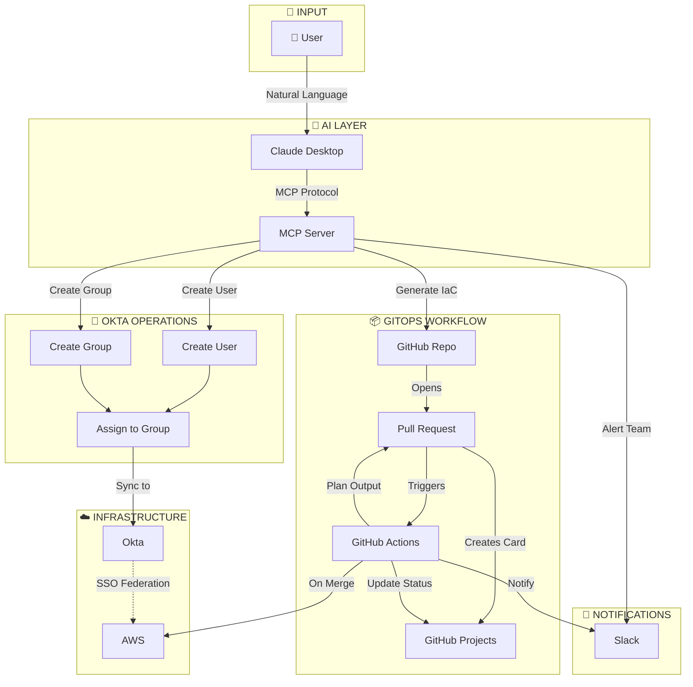

# Infrastructure Automation MCP

**AI-Powered CI/CD for Okta, AWS & Terraform**

[](https://www.terraform.io/)
[](https://aws.amazon.com/)
[](https://www.okta.com/)
[](https://modelcontextprotocol.io/)

## ⚡ Quick Start

### Option A: Watch the Video
🎥 <a href="https://www.loom.com/share/f9834c96dbd34dc380d274aa623f28d1" target="_blank">Click here for a 5-minute demo</a>

### Option B: Try It Yourself

1. **Clone & Install**
```bash
   git clone https://github.com/metalfa/infra-automation-mcp.git
   cd infra-automation-mcp
   python -m venv venv && source venv/bin/activate
   pip install -e .
```

2. **Configure** (see [Installation](#installation))

3. **Ask Claude:**
```
   Create a new user john.doe@example.com, generate Terraform 
   for an EC2 instance, and show me the access review report.
```

4. **Watch the magic happen** ✨

> Transform infrastructure management from CLI commands to natural language — without sacrificing security, auditability, or DevOps best practices.

This project is a **production-grade Model Context Protocol (MCP) server** that enables AI assistants (Claude) to manage enterprise infrastructure through **natural language**, while enforcing **GitOps, CI/CD, and human approval gates**.

Instead of memorizing CLIs, navigating cloud consoles, or hand-writing Terraform, users describe *intent* — the system safely turns that intent into **reviewed, auditable infrastructure changes**.

---

## 📋 About This Project

> **This project was built as a take-home exercise for the Systems Engineer position at ActiveCampaign.**

**The Challenge:**
> *"Design a CI/CD pipeline for managing an Okta instance and EC2 or ECS/EKS server set."*

**My Approach:**

Rather than submitting static diagrams or documentation, I built a **fully functional, production-grade system** that demonstrates:

| Requirement | My Implementation |
|-------------|-------------------|
| Okta Management | ✅ Full CRUD operations via MCP + Terraform generation |
| EC2 Provisioning | ✅ Auto-generated Terraform with free-tier defaults |
| CI/CD Pipeline | ✅ GitHub Actions with Plan → Approve → Apply → Auto-destroy |
| Infrastructure as Code | ✅ All resources defined in Terraform |
| Security | ✅ GitOps workflow, human approval gates, no direct deployments |
| Audit Trail | ✅ Complete Git history + GitHub Projects tracking |
| Notifications | ✅ Slack integration for approvals and status updates |

**Why I Went Beyond:**

I believe the best way to demonstrate DevOps expertise is to **build something real**. This project showcases not just *what* a CI/CD pipeline should do, but *how* modern AI-augmented infrastructure automation can transform the way teams work — reducing a 45-minute manual process to a 30-second conversation.

---

## 🎯 Why This Exists

### The Problem with Traditional Infrastructure Work

A simple onboarding flow often requires:
```bash
# Create Okta user
okta users create --firstName Bruce --lastName Lee --email bruce@demoac.com

# Find group
okta groups list | grep "Security-Engineering"

# Add user to group
okta groups members add 00g123... 00u987...

# Write Terraform
vim terraform/users.tf

# Create PR
git checkout -b add-user-bruce
git add .
git commit -m "Add user Bruce Lee"
git push origin add-user-bruce
gh pr create

# Wait, review, apply
terraform apply
```

| Metric | Traditional Approach |
|--------|---------------------|
| ⏱️ Time | 30–45 minutes |
| ⚠️ Errors | Common (typos, wrong IDs, missed steps) |
| 📄 Audit | Fragmented across tools |
| 🧠 Cognitive Load | High (multiple CLIs, consoles, contexts) |

---

### The Same Outcome with This MCP

**You say:**
```
1. Create an Okta user for "bruce.lee@demoac.com" (Bruce Lee, Security Engineer), 
   create a Security-Engineering group, add him to it, and send him a Slack welcome message

2. Generate Terraform for a free-tier EC2 instance called "bruce-lee-devbox"

3. Generate IAM configuration that maps to Okta for SSO

4. Create a GitHub PR with these changes and send a Slack message for approval
```

**Claude responds:**

| Step | Result |
|------|--------|
| ✅ | Created Okta user and assigned to groups |
| ✅ | Sent personalized Slack welcome message with team and access details |
| ✅ | Generated production-ready Terraform (IAM, EC2, SSO mapping) |
| ✅ | Opened GitHub PR with full `terraform plan` output |
| ✅ | Sent Slack notification to approvers for pending review |
| ✅ | Applied infrastructure after human approval |
| ✅ | Maintained complete Git-based audit trail |

| Metric | MCP Approach |
|--------|-------------|
| ⏱️ Time | ~30 seconds |
| ✅ Errors | Zero (validated, templated) |
| 🔐 Audit | Complete Git history |
| 🧠 Cognitive Load | Minimal (natural language) |

---

## 🖌️ Core Design Principles

| Principle | Implementation |
|-----------|----------------|
| **AI is an interface, not a control plane** | Claude assists; humans approve |
| **No direct deployments** | All changes flow through GitHub PRs |
| **Human approval required** | Merge gates enforce review |
| **Least privilege by default** | Scoped IAM roles and policies |
| **IaC remains source of truth** | Terraform state is authoritative |

> This system **augments** DevOps workflows — it does not bypass them.

---

## 🚀 Key Capabilities

### Identity Management (Okta)

| Capability | Tool | Description |
|------------|------|-------------|
| List users | `okta_list_users` | Search and audit user accounts |
| List groups | `okta_list_groups` | Inspect group membership |
| Create user | `okta_create_user` | Provision users + generate IaC |
| Create group | `okta_create_group` | Group creation + Terraform output |

### Collaboration & Notifications (Slack)

| Capability | Tool | Description |
|------------|------|-------------|
| Welcome message | `send_slack_notification` | Onboarding message with team, role, access info |
| PR approval alert | `send_slack_notification` | Notifies reviewers when infrastructure PR is ready |
| Deployment status | `send_slack_notification` | Confirms apply/destroy completion |

### AWS Infrastructure

| Capability | Tool | Description |
|------------|------|-------------|
| List EC2 instances | `aws_list_ec2_instances` | EC2 instance discovery |
| Describe instance | `aws_describe_instances` | Detailed instance inspection |
| List IAM roles | `aws_list_iam_roles` | Access and policy auditing |
| Identity check | `aws_get_identity` | Credential validation |

### Terraform Generation

| Capability | Tool | Description |
|------------|------|-------------|
| Generate EC2 instances | `terraform_generate_ec2` | develop instances with security groups |
| IAM + Okta SSO | `terraform_generate_iam_user_with_okta` | Federated access with SAML mapping |
| Generate S3 Buckets | `terraform_generate_S3` | Version ID History |
| IAM role | `terraform_generate_iam_role` | Scoped trust policies |

### CI/CD & GitOps

| Capability | Tool | Description |
|------------|------|-------------|
| Create PR | `create_infrastructure_pr` | Automated GitHub PR creation |
| List PRs | `list_open_prs` | View pending infrastructure changes |
| Pipeline status | `list_pipeline_runs` | CI/CD workflow visibility |
| Full workflow | `complete_infrastructure_workflow` | End-to-end: Generate → PR → Notify → Deploy |
| Project tracking | GitHub Projects | Auto-updates: Backlog → In Progress → Done |

### Compliance & Security

| Capability | Tool | Description |
|------------|------|-------------|
| Access review | `generate_access_review` | SOC2 / ISO27001 compliance reports |
| User audit | `check_user_access` | Complete access report for any user |

---
## 🏗️ Architecture Overview

| Component | Purpose |
|-----------|---------|
| **User** | Natural language request ("Create user and EC2 instance") |
| **Claude Desktop** | AI assistant interface |
| **MCP Server** | Policy enforcement, validation, orchestration |
| **Create User** | Provisions new user in Okta |
| **Create Group** | Creates Okta group for access control |
| **Assign to Group** | Adds user to appropriate group |
| **Okta** | Identity & Access Management (syncs users/groups) |
| **GitHub Repo** | Terraform code storage |
| **Pull Request** | Human review gate |
| **GitHub Actions** | CI/CD pipeline (plan/apply/destroy) |
| **GitHub Projects** | Automated tracking: Backlog → In Progress → Done |
| **AWS** | EC2, IAM, S3 infrastructure |
| **Slack** | Alerts, approvals, status notifications |

---

### 🔑 Key Properties

| Property | Description |
|----------|-------------|
| 🛡️ **Human Approval Gates** | No deployment without PR review and merge |
| 📜 **Immutable Audit Trail** | Every change tracked in Git history |
| 🔒 **Policy-Enforced Execution** | MCP validates before any action |
| 🚫 **Zero Direct AI Deployments** | AI assists; humans authorize |
| 📊 **Automated Project Tracking** | Cards flow: Backlog → In Progress → Done |

---

## 🔐 Security Model

| Security Feature | Implementation |
|------------------|----------------|
| **No hardcoded secrets** | Environment variables only |
| **Credential isolation** | Separate tokens per service |
| **Git-backed audit trail** | Every change tracked |
| **Least-privilege IAM** | Scoped roles and policies |
| **State encryption** | Terraform state encrypted in S3 |
| **MFA-ready** | Okta policies support enforcement |
| **Cost protection** | Auto-destroy demo resources after 3 minutes |

---

## 🛠️ CI/CD Pipeline (GitHub Actions)

### On Pull Request
```
┌─────────────────┐
│ terraform fmt   │ → Code formatting check
├─────────────────┤
│ terraform init  │ → Initialize providers
├─────────────────┤
│ terraform plan  │ → Preview changes
├─────────────────┤
│ Post to PR      │ → Plan visible to reviewers
├─────────────────┤
│ Update Project  │ → Moves card to "Backlog"
└─────────────────┘
```

### On Merge to Main
```
┌─────────────────┐
│ terraform apply │ → Create resources
├─────────────────┤
│ Wait 3 minutes  │ → Demo observation window
├─────────────────┤
│ terraform destroy│ → Auto-cleanup (cost control)
├─────────────────┤
│ Slack notify    │ → Confirm completion
├─────────────────┤
│ Update Project  │ → Moves card to "Done"
└─────────────────┘
```

---

## Installation

### Prerequisites

| Requirement | Version |
|-------------|---------|
| Python | 3.10+ |
| Terraform | 1.6+ |
| AWS CLI | Configured |
| Okta | API access |
| GitHub | Account + PAT |
| Claude Desktop | Latest |

### Quick Start
```bash
# Clone the repository
git clone https://github.com/metalfa/infra-automation-mcp.git
cd infra-automation-mcp

# Create virtual environment
python -m venv venv

# Activate (Windows)
.\venv\Scripts\Activate.ps1

# Activate (Mac/Linux)
source venv/bin/activate

# Install package
pip install -e .
```

### Configuration

1. **Create environment file:**
```bash
   cp .env.example .env
```

2. **Configure credentials in `.env`:**
```env
   # Okta
   OKTA_BASE_URL=https://your-org.okta.com
   OKTA_API_TOKEN=your-okta-token
   
   # AWS
   AWS_REGION=us-east-1
   AWS_ACCESS_KEY_ID=your-access-key
   AWS_SECRET_ACCESS_KEY=your-secret-key
   
   # GitHub
   GITHUB_TOKEN=your-github-pat
   GITHUB_REPO=your-username/infra-automation-mcp
   
   # Slack
   SLACK_WEBHOOK_URL=https://hooks.slack.com/services/xxx
```

3. **Register MCP server in Claude Desktop**, restart, and you're ready.

---

## 💬 Example Use Cases

### 👤 Employee Onboarding
```
Create user maria.garcia@company.com (Maria Garcia, DevOps Engineer),
add her to the devops-team group, generate Terraform for her IAM access,
create a PR, and send a Slack welcome message.
```

### 🖥️ Development Environment
```
Provision a free-tier EC2 instance called "dev-sandbox" with SSH access,
generate the Terraform code, and create a PR for review.
```

### 🔒 SOC2 Access Review
```
Generate a comprehensive access review report showing all Okta users,
their group memberships, inactive accounts, and security recommendations.
```

### 🚀 Full Infrastructure Workflow
```
Set up infrastructure for the new Data Science team:
1. Create Okta group "data-science"
2. Create user alex.kim@company.com
3. Generate EC2 and IAM Terraform
4. Create PR and notify approvers via Slack
```

> All driven through conversation — all enforced through GitOps.

---

## 📊 Business Impact

| Metric | Traditional | With MCP | Improvement |
|--------|-------------|----------|-------------|
| Provisioning time | 30-45 min | ~30 sec | **98% faster** |
| Manual errors | Common | Zero | **Eliminated** |
| Audit compliance | Partial | 100% | **Complete** |
| Onboarding friction | High | Minimal | **Streamlined** |
| Operational risk | Elevated | Reduced | **Controlled** |

---

## 🗺️ Roadmap

- [x] Okta user and group management
- [x] AWS EC2 and IAM provisioning
- [x] Terraform code generation
- [x] GitHub PR automation
- [x] Slack notifications
- [x] Auto-destroy for cost control
- [ ] Azure AD / Entra ID integration
- [ ] Intune & Kandji MDM support
- [ ] Kubernetes manifest generation
- [ ] Policy-as-Code (OPA / Sentinel)
- [ ] Cost estimation (Infracost)
- [ ] Multi-cloud support (GCP, Azure)

---

## 🎓 Why This Matters

| Traditional DevOps | AI-Augmented DevOps |
|--------------------|---------------------|
| CLI memorization | Intent-driven requests |
| Manual IaC authoring | Generated & validated code |
| Constant tool switching | Single conversational interface |
| Tribal knowledge silos | Accessible, documented workflows |

> **The future of DevOps is conversational** — where engineers focus on *what* needs to happen, not *how* to execute it across dozens of tools.

---

## 🎯 How This Addresses the Challenge

| Challenge Requirement | How This Project Delivers |
|-----------------------|---------------------------|
| **"Design a CI/CD pipeline"** | GitHub Actions workflow with plan, apply, and destroy stages |
| **"Managing an Okta instance"** | Full Okta integration: users, groups, SSO mapping, access reviews |
| **"EC2 or ECS/EKS server set"** | Terraform generation for EC2 (free-tier) and S3 Buckets |
| **"Open-ended by nature"** | Went beyond static design — built a working, AI-powered system |
| **"Countless answers"** | Chose an innovative approach: natural language → infrastructure |

### 💡 What Makes This Solution Different

1. **It's Real** — Not diagrams, but working code you can clone and run
2. **It's Innovative** — AI-powered interface while maintaining GitOps discipline
3. **It's Practical** — Solves actual pain points (onboarding, provisioning, compliance)
4. **It's Safe** — Human approval gates, auto-destroy, least-privilege defaults
5. **It's Extensible** — Modular design ready for Entra ID, Intune, Kubernetes, multi-cloud

---

## 👤 Author

**Faycal Ben Sassi**  
IT Systems Engineer

[](https://github.com/metalfa)
[](https://www.linkedin.com/in/faycal-ben-sassi/)
[](mailto:bensassi.faysel@gmail.com)

---


<p align="center">
  <strong>Built to demonstrate an AI-driven infrastructure automation for ActiveCampaign — Systems Engineer technical assessment</strong><br/><br/>
     <em>"The best way to predict the future is to build it — and the future of DevOps is conversational."</em>
</p>
